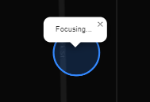
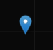

# Geo Path

This app is deployed <a href='https://geopathxyz.herokuapp.com'>here</a>.

## Description

As an avid long distance skater, I want to track statistics relative to my skating. I would also like to see the path I took drawn out on a map after a long skate. I created this project to do just that. Geo Path lets anyone draw their path and see their current speed, total distance, and total time, and lets logged in users save their statistics to their profile. The creation of this project gave me good practice with the MERN stack, and opened me up to the possibilities provided by the open source Leaflet maps api.

## Table of Contents

- [Installation](#installation)
- [Usage](#usage)
- [Credits](#credits)
- [License](#license)
- [Features](#features)
- [Contribution](#how-to-contribute)
- [Testing](#tests)

## Installation

1. Install <a href='https://nodejs.org/en/download/'>Node</a>.
2. Clone or Fork this repository.
3. Using your CLI of choice, navigate to the root of the cloned/forked project.
4. Run 'npm i' to install dependencies.
5. Replace the '.env.EXAMPLE' file with your environment variables.

## Usage

Tutorial video <a href='https://drive.google.com/file/d/1vKDBOWkIWkEuFcggkwsVZwnYyhjPW_fJ/view'>here</a>.

1. On the home page, press the Sign Up button to make an account or the Log In button if you already have one.

2. Press the Draw Path button if you don't want to save your overall statistics.
3. (For Logged in users) On the Profile Page, press the Draw Path button to create a new path.

4. On the Map Page, press the Start button and allow location access to begin drawing.

5. If you see a circle, wait for it to narrow down and turn into a marker. 
6. When a marker appears, movements you make in the real world will appear on the map, and your statistics will be updated accordingly. 

7. (For Logged in users) Press the Profile Icon in the bottom right if you want to stop drawing and go back to the profile page. 

8. When at least two points have been added, press the Save Icon in the bottom left to save your path and update your overall statistics. 
 ==>
 

## Credits

<a href='https://leafletjs.com/'>Leaflet</a>, <a href='https://www.youtube.com/watch?v=6_w-Mb_78iY&list=PLm76kc4VPkn27kRYq-58COO5r5bQdrKyy'>Learning with Mapster</a>

## License

This project is licensed with the open source MIT license.

## Features

- See your path drawn on a map while moving about the Earth.
- See your current speed, path distance, and time while drawing a path.
- Logged in users can save their paths to see their overall statistics.

## How to Contribute

If you created an application or package and would like other developers to contribute it, you can include guidelines for how to do so. The [Contributor Covenant](https://www.contributor-covenant.org/) is an industry standard, but you can always write your own if you'd prefer.

## Tests

Go the extra mile and write tests for your application. Then provide examples on how to run them here.
